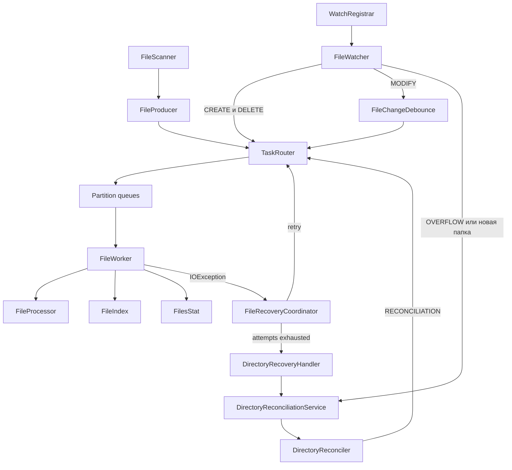

# File Indexer — Progress

Учебный pet-проект на Java для практики многопоточности, Java NIO и построения
устойчивого файлового индекса.

Главная цель — не просто применить классы из `java.util.concurrent`, а понять,
какую проблему решает каждый механизм и какие гарантии он даёт.

## Текущее состояние

Завершён этап 10: устойчивость и восстановление индекса.

Последний полный прогон:

```text
Tests run: 37, Failures: 0, Errors: 0, Skipped: 0
BUILD SUCCESS
```

Сейчас программа умеет:

- рекурсивно находить `.md`-файлы;
- строить и обновлять индекс в памяти;
- обрабатывать файлы несколькими Worker-потоками;
- сохранять порядок событий одного пути через partitioning очередей;
- следить за существующими и новыми директориями через `WatchService`;
- объединять частые события `MODIFY` через debounce;
- корректно обрабатывать повторные `CREATE`, `DELETE` и неизвестный `MODIFY`;
- восстанавливать файл через ограниченную цепочку retry;
- после исчерпания retry пересканировать родительскую директорию;
- восстанавливать индекс после `OVERFLOW`;
- объединять повторные запросы reconciliation одной директории;
- запускать watcher до первоначального сканирования;
- сообщать `Main` об успешном или ошибочном запуске watcher.

Текущая задача:

> Убрать magic string `"STOP"`, добавить отдельные служебные задачи `Stop` и
> `Barrier`, затем дожидаться полной обработки initial scan перед выводом индекса.

---

## Правило работы над проектом

После каждого изменения проект должен:

1. компилироваться;
2. проходить существующие тесты;
3. получать тест на новый сценарий или найденную ошибку;
4. корректно завершать созданные в тесте потоки и executor-ы;
5. сохранять уже установленные гарантии порядка и восстановления.

Крупные изменения выполняются небольшими шагами: реализация, проверка кода,
автоматический тест, полный прогон.

---

# Этап 1 — Первоначальный индекс

- [x] Получать путь к директории от пользователя
- [x] Проверять существование директории
- [x] Рекурсивно обходить дерево через `Files.walk()`
- [x] Отбирать обычные файлы
- [x] Отбирать `.md`-файлы
- [x] Создавать `FileInfo`
- [x] Читать размер файла
- [x] Читать время последнего изменения
- [x] Сохранять результат в индекс
- [ ] Читать метаданные одним вызовом `Files.readAttributes()`
- [ ] Определить политику для symbolic links
- [ ] Определить, нужно ли поддерживать `.MD` без учёта регистра

Результат:

```text
Directory → FileScanner → Path → FileTask → FileInfo → FileIndex
```

---

# Этап 2 — Producer / Consumer

- [x] Создать `FileTask`
- [x] Реализовать `FileProducer`
- [x] Передавать задачи через `BlockingQueue`
- [x] Использовать ограниченные `ArrayBlockingQueue`
- [x] Создать несколько Worker-потоков
- [x] Получать задачи через `take()`
- [x] Корректно обрабатывать interruption
- [x] Проверить обработку большого количества событий
- [ ] Определить поведение watcher при длительно заполненных очередях

---

# Этап 3 — Потокобезопасный индекс и статистика

- [x] Использовать `ConcurrentHashMap<Path, FileInfo>`
- [x] Добавлять и обновлять записи
- [x] Удалять записи
- [x] Получать immutable snapshot путей
- [x] Считать количество файлов
- [x] Считать общий размер
- [x] Считать новые цепочки ошибок
- [x] Корректировать размер при повторном `CREATE` и `MODIFY`
- [x] Не допускать отрицательной статистики при повторном `DELETE`
- [x] Проверить соответствие статистики независимому снимку диска
- [ ] Полностью передать владение Map классу `FileIndex`
- [ ] Скрыть `AtomicInteger` и `LongAdder` внутри `FilesStat`
- [ ] Добавить смысловые методы изменения статистики
- [ ] Добавить полный immutable snapshot индекса и статистики

---

# Этап 4 — Порядок событий одного файла

- [x] Выбрать partitioning задач по `Path`
- [x] Создать отдельную очередь для каждого Worker
- [x] Использовать `Math.floorMod(path.hashCode(), queueCount)`
- [x] Направлять один путь одному Worker
- [x] Сохранить параллельную обработку разных путей
- [x] Проверить повторные события под нагрузкой
- [ ] Добавить отдельный regression-тест `CREATE → MODIFY → DELETE`
- [ ] Добавить отдельный тест параллельной обработки разных путей
- [ ] Добавить тест маршрутизации при отрицательном `hashCode`

Гарантия:

```text
Один Path → одна FIFO-очередь → один Worker
```

Разные пути могут попасть разным Worker и выполняться параллельно. Несколько
разных путей могут попасть в одну partition и выполняться последовательно.

---

# Этап 5 — Рекурсивный WatchService

- [x] Зарегистрировать существующие вложенные директории
- [x] Вынести регистрацию в `WatchRegistrar`
- [x] Хранить связь `WatchKey → Path`
- [x] Обрабатывать события вложенных директорий
- [x] Регистрировать новое дерево начиная с созданного `fullPath`
- [x] Запускать reconciliation содержимого новой директории
- [x] Удалять недействительный `WatchKey`
- [x] Проверить событие в заранее существующей вложенной директории
- [x] Проверить обнаружение файла в директории, созданной после запуска watcher
- [ ] Проверить удаление дерева директорий
- [ ] Проверить перемещение заполненной директории
- [ ] Проверить очень глубокую структуру каталогов

---

# Этап 6 — Корректный запуск initial scan и watcher

- [x] Запускать Worker до источников задач
- [x] Запускать watcher до первоначального сканирования
- [x] Добавить `CountDownLatch` готовности watcher
- [x] Сигнализировать после рекурсивной регистрации существующих директорий
- [x] Начинать initial scan только после сигнала готовности
- [x] Освобождать latch при ошибке запуска watcher
- [x] Передавать ошибку запуска в `Main`
- [x] Проверить успешный и ошибочный запуск watcher
- [ ] Добавить barrier-задачу для каждой partition-очереди
- [ ] Дождаться обработки всех initial-задач
- [ ] Печатать первоначальный индекс только после barrier
- [ ] Проверить создание, изменение и удаление файла во время initial scan

Текущий порядок запуска:

```text
Start workers
      ↓
Start watcher
      ↓
Wait until existing directories are registered
      ↓
Run initial scan
      ↓
Producer finishes enqueueing tasks
```

Следующая требуемая гарантия:

```text
Producer finishes
      ↓
One Barrier per queue
      ↓
Every Worker reaches its Barrier
      ↓
Initial index is ready
```

---

# Этап 7 — Надёжный debounce

- [x] Откладывать `MODIFY` на 500 мс
- [x] Отменять предыдущую ожидающую задачу
- [x] Не блокировать watcher на время ожидания
- [x] Отправлять итоговую задачу через `TaskRouter`
- [x] Отменять ожидающий `MODIFY` при `DELETE`
- [ ] Сделать замену `ScheduledFuture` в Map атомарной
- [ ] Не позволять старой задаче удалить ссылку на новую
- [ ] Удалять завершённую задачу из Map в `finally`
- [ ] Определить поведение `CREATE → MODIFY`
- [ ] Определить поведение `MODIFY → DELETE → CREATE`
- [ ] Добавить тест большого количества быстрых `MODIFY`
- [ ] Добавить тест конкурентных вызовов debounce
- [ ] Добавить тест shutdown во время ожидания debounce

---

# Этап 8 — Корректная модель служебных задач

- [ ] Создать общий тип задач Worker
- [ ] Сделать `FileTask` файловой задачей общего типа
- [ ] Добавить отдельную `StopTask`
- [ ] Добавить отдельную `BarrierTask`
- [ ] Перевести очереди и Worker на общий тип
- [ ] Убрать magic string `"STOP"`
- [ ] Запретить `null` в `changeType`
- [ ] Проверить, что служебную задачу нельзя спутать с настоящим файлом

Планируемая модель:

```text
WorkerTask
├── FileTask
├── BarrierTask
└── StopTask
```

---

# Этап 9 — Lifecycle и shutdown

- [x] Прерывать watcher
- [x] Закрывать его локальный `WatchService`
- [x] Вызывать `shutdown()` для executor-ов
- [x] Использовать `awaitTermination()`
- [x] Использовать `shutdownNow()` после таймаута
- [x] Останавливать Worker после источников обычных задач
- [x] Останавливать recovery scheduler
- [ ] Не принимать новые debounce, recovery и reconciliation-запросы после shutdown
- [ ] Гарантировать cleanup остальных ресурсов, если один шаг был прерван
- [ ] Убрать `STOP` на основе специального пути
- [ ] Проверить shutdown при заполненных очередях
- [ ] Проверить shutdown во время initial scan
- [ ] Проверить shutdown во время reconciliation
- [ ] Проверить shutdown во время recovery
- [ ] Проверить shutdown во время debounce
- [ ] Вынести lifecycle в `FileIndexerService`
- [ ] Реализовать `AutoCloseable`

Целевой порядок:

```text
Stop watcher
      ↓
Stop accepting delayed and rescan requests
      ↓
Finish or cancel rescan, debounce and recovery
      ↓
Send StopTask to workers
      ↓
Join workers
      ↓
Create final snapshot
```

---

# Этап 10 — Устойчивость и восстановление индекса

Статус: завершён в выбранных границах учебного проекта.

- [x] Обрабатывать файл, исчезнувший до чтения метаданных
- [x] Обрабатывать `AccessDeniedException` как обычную recovery-ошибку
- [x] Обрабатывать повторный `CREATE` как upsert
- [x] Безопасно обрабатывать повторный `DELETE`
- [x] Обрабатывать `MODIFY` неизвестного файла как upsert
- [x] Создавать только одну recovery-цепочку для одного пути
- [x] Выполнять три retry с задержками 500, 1000 и 2000 мс
- [x] Отменять recovery после успешной обработки
- [x] После исчерпания retry проверять родительскую директорию
- [x] Создать `RecoveryExhaustedHandler`
- [x] Создать `DirectoryRecoveryHandler`
- [x] Создать `DirectoryReconciler`
- [x] Объединять пути с диска и из индекса
- [x] Добавлять пропущенные файлы через reconciliation
- [x] Обновлять существующие файлы через reconciliation
- [x] Удалять отсутствующие файлы через reconciliation
- [x] Выполнять reconciliation вне watcher-потока
- [x] Объединять повторные запросы одной директории
- [x] Выполнять дополнительный проход после запроса во время текущего обхода
- [x] Очищать состояние сервиса после `IOException` и interruption
- [x] Обрабатывать `WatchService.OVERFLOW` через reconciliation
- [x] Не создавать бесконечный recovery-цикл для проблемной задачи reconciliation
- [x] Проверить полную цепочку `ошибка → retry → parent reconciliation`
- [x] Сравнить итоговый индекс с независимым снимком диска
- [x] Проверить 200 файлов и 800 повторных событий с четырьмя Worker

Принятые решения:

- временная ошибка чтения не удаляет старую запись;
- `CREATE` и `MODIFY` используют одну upsert-логику;
- `NoSuchFileException` означает, что запись нужно удалить;
- счётчик ошибок увеличивается при создании новой recovery-цепочки, а не на
  каждой повторной попытке;
- после окончательной ошибки reconciliation файл считается проблемным до
  следующего обычного события или нового rescan;
- ошибка самого обхода директории не оставляет сервис навсегда в `RUNNING` и не
  мешает будущему запросу.

Ограничения тестирования:

- реальные Windows ACL не изменяются; проверяется реакция на
  `AccessDeniedException`;
- физическое переполнение системного буфера не создаётся; проверяется путь
  `OVERFLOW → reconciliation`;
- полностью недоступный после reconciliation файл логируется, но не запускает
  бесконечный цикл.

---

# Этап 11 — Поиск и пользовательские операции

Начинать после завершения этапов 6–9.

- [ ] Получать согласованный immutable snapshot индекса
- [ ] Искать по имени
- [ ] Искать по расширению
- [ ] Искать по размеру
- [ ] Искать по времени изменения
- [ ] Искать текст внутри файлов
- [ ] Отменять долгий поиск
- [ ] Выбрать механизм выполнения на основании задачи

---

# Этап 12 — Автоматическое тестирование

Подключены JUnit 5 и Maven Surefire.

### Реализовано

- [x] Unit-тесты `FileIndex`
- [x] Повторный `CREATE`
- [x] Повторный `DELETE`
- [x] Удаление неизвестного файла
- [x] `MODIFY` неизвестного файла
- [x] Исчезновение файла до обработки
- [x] Recovery с увеличивающейся задержкой
- [x] Отмена recovery после успеха
- [x] Независимые recovery-цепочки разных файлов
- [x] Исчерпание recovery и вызов handler
- [x] Parent reconciliation после исчерпания retry
- [x] Reconciliation диска и индекса
- [x] Объединение повторных rescan-запросов
- [x] Повторный запрос после завершения reconciliation
- [x] Очистка reconciliation после ошибки и interruption
- [x] Обработка `OVERFLOW`
- [x] Сигнал готовности watcher
- [x] Ошибка запуска watcher
- [x] Существующая вложенная директория
- [x] Новая вложенная директория
- [x] Сходимость индекса и статистики с диском
- [x] Stress-тест повторных событий

### Осталось

- [ ] Unit-тест `FileScanner`
- [ ] Unit-тест `FileProcessor`
- [ ] Unit-тест `FilesStat`
- [ ] Unit-тест `TaskRouter`
- [ ] Unit-тест `WatchRegistrar`
- [ ] Конкурентные тесты `FileChangeDebounce`
- [ ] `CREATE → MODIFY → DELETE`
- [ ] Изменение файла во время initial scan
- [ ] Перемещение заполненной директории
- [ ] Shutdown под нагрузкой
- [ ] Проверка отсутствия оставшихся потоков после полного lifecycle

Тесты не должны зависеть от произвольного `Thread.sleep()`. Для синхронизации
нужно использовать наблюдаемое состояние, `CountDownLatch`, `CyclicBarrier` или
`Phaser` с ограниченным таймаутом.

---

# Этап 13 — Финализация

- [x] Обновить README после этапа 10
- [x] Добавить актуальную архитектурную схему
- [x] Описать recovery и reconciliation
- [x] Описать ограничения `WatchService` и тестов
- [ ] Удалить неиспользуемые импорты и старые комментарии
- [ ] Заменить `System.out` и `printStackTrace()` логированием
- [ ] Привести naming к одному стилю
- [ ] Переименовать `scanFile()` в `scanFiles()` или `scan()`
- [ ] Полностью скрыть внутреннее состояние индекса и статистики
- [ ] Вынести количество Worker, размеры очередей и задержки в конфигурацию
- [ ] Зафиксировать `maven-compiler-plugin`
- [ ] Использовать `maven.compiler.release`
- [ ] Добавить примеры запуска из собранного JAR
- [ ] Подготовить репозиторий к публикации

---

## Актуальная архитектура



---

## Ближайший рабочий список

Выполнять сверху вниз:

1. [ ] Зафиксировать этап 10 отдельным коммитом
2. [ ] Создать общий тип `WorkerTask`
3. [ ] Подключить к нему `FileTask`
4. [ ] Добавить `StopTask`
5. [ ] Добавить `BarrierTask`
6. [ ] Перевести очереди и Worker на новый тип
7. [ ] Убрать `"STOP"` и `null`
8. [ ] Добавить barrier initial scan в `Main`
9. [ ] Дождаться всех initial-задач перед `printState()`
10. [ ] Добавить regression-тесты initial scan
11. [ ] Исправить конкурентные гонки debounce
12. [ ] Усилить lifecycle и shutdown
13. [ ] Инкапсулировать индекс и статистику
14. [ ] Перейти к поиску

---

## Критерий готовности ядра

Ядро можно считать готовым к поиску, когда:

- все автоматические тесты проходят;
- первоначальный индекс печатается только после обработки initial-задач;
- один путь обрабатывается строго последовательно;
- разные пути могут обрабатываться параллельно;
- debounce не теряет и не дублирует итоговую задачу;
- создание и перемещение вложенных директорий не теряет файлы;
- recovery и `OVERFLOW` восстанавливают индекс;
- итоговая статистика соответствует snapshot индекса;
- shutdown не принимает новые задачи и не оставляет активные потоки.
