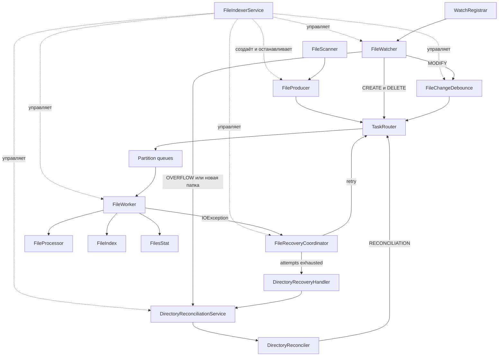

# File Indexer → локальная система версий — Progress

Учебный pet-проект на Java для практики многопоточности, Java NIO и построения
устойчивого файлового индекса. Следующее направление — локальная система
версий с сохранением содержимого файлов и линейной историей коммитов.

Главная цель — не просто применить классы из `java.util.concurrent`, а понять,
какую проблему решает каждый механизм и какие гарантии он даёт.

## Текущее состояние

Завершены этапы 6, 7, 8, 9 и 10: корректный initial scan, надёжный debounce,
модель служебных задач, lifecycle, согласованный shutdown, устойчивость и
восстановление индекса. `Main` использует `FileIndexerService`, а крайние
переходы состояний и остановка при заполненной очереди покрыты тестами.

Завершена инкапсуляция: `FileIndex` владеет своей Map, `FilesStat` самостоятельно
создаёт счётчики и предоставляет смысловые операции. Добавлены пять unit-тестов
статистики, включая конкурентное добавление файлов.

Последний подтверждённый полный прогон (2026-10-05):

```text
Tests run: 112, Failures: 0, Errors: 0, Skipped: 0
BUILD SUCCESS
```

Текущий набор содержит 112 выполнений в 19 классах, полный прогон успешен.
Исправлены перенос/удаление дерева, повторная reconciliation после
`UncheckedIOException`, передача ошибок initial scan, `MODIFY` папок `.md`,
нормализация корня и согласованность snapshot. Добавлены regression-тесты.
Оставшиеся пробелы перечислены в [`INDEXER_REVIEW.md`](docs/INDEXER_REVIEW.md).

Сейчас программа умеет:

- рекурсивно находить `.md`-файлы;
- строить и обновлять индекс в памяти;
- обрабатывать файлы несколькими Worker-потоками;
- сохранять порядок событий одного пути через partitioning очередей;
- следить за существующими и новыми директориями через `WatchService`;
- объединять частые события `MODIFY` через debounce;
- корректно обрабатывать повторные `CREATE`, `DELETE` и неизвестный `MODIFY`;
- восстанавливать файл через ограниченную цепочку retry;
- после исчерпания retry пересканировать родительскую директорию;
- восстанавливать индекс после `OVERFLOW`;
- объединять повторные запросы reconciliation одной директории;
- запускать watcher до первоначального сканирования;
- сообщать `Main` об успешном или ошибочном запуске watcher;
- использовать отдельные `FileTask`, `BarrierTask` и `StopTask`;
- дожидаться обработки initial scan во всех partition-очередях перед выводом
  первоначального индекса;
- объединять 2000 быстрых `MODIFY` в одну итоговую задачу;
- отменять отложенный `MODIFY` при `DELETE` и shutdown;
- управлять состояниями `NEW`, `STARTING`, `RUNNING`, `STOPPING`, `STOPPED`;
- корректно завершаться при конкурентных `start()` и `shutdown()`;
- дожидаться первого shutdown при повторном конкурентном вызове;
- завершать очистку при interruption и восстанавливать interruption-флаг.

Текущая задача:

> Закрыть оставшиеся пункты аудита (ошибки регистрации и тип файла при обработке),
> зафиксировать основу индексатора, затем начать этап 14.

## Новый курс проекта

Решение: сначала версии сохраняются по явной команде `commit`. Автоматическая
история добавляется после надёжного ручного сохранения и сравнения версий.

Первая версия работает с одним репозиторием и линейной историей `.md`-файлов.
Коммит сохраняет все поддерживаемые файлы рабочей директории; отдельного
staging area пока нет. Формат собственного хранилища не обязан быть совместим
с настоящим Git. Имя служебной директории выбираем на этапе 14, не используем
для неё `.git` существующего проекта.

Ветки, merge, удалённые репозитории, GitHub, GUI и пользовательский поиск
отложены. Расширение списка типов файлов обсуждаем после первой рабочей версии.

Важно различать:

- текущий `FileIndex` хранит метаданные живых файлов;
- сохранённая версия содержит неизменяемые байты файла;
- коммит содержит пути и ссылки на сохранённые версии;
- `diff` вычисляется из двух версий, а не из событий watcher.

Watcher помогает обнаруживать изменения, но не является источником истины
для коммита. Перед сохранением нужен независимый обход диска. Снимок Map и
barrier Worker не замораживают файловую систему и не гарантируют согласованного
снимка файлов, которые в этот момент редактируются.

---

## Правило работы над проектом

После каждого изменения проект должен:

1. компилироваться;
2. проходить существующие тесты;
3. получать тест на новый сценарий или найденную ошибку;
4. корректно завершать созданные в тесте потоки и executor-ы;
5. сохранять уже установленные гарантии порядка и восстановления.

Крупные изменения выполняются небольшими шагами: реализация, проверка кода,
автоматический тест, полный прогон.

---

# Этап 1 — Первоначальный индекс

- [x] Получать путь к директории от пользователя
- [x] Проверять существование директории
- [x] Рекурсивно обходить дерево через `Files.walk()`
- [x] Отбирать обычные файлы
- [x] Отбирать `.md`-файлы
- [x] Создавать `FileInfo`
- [x] Читать размер файла
- [x] Читать время последнего изменения
- [x] Сохранять результат в индекс
- [ ] Читать метаданные одним вызовом `Files.readAttributes()`
- [ ] Определить политику для symbolic links
- [ ] Определить, нужно ли поддерживать `.MD` без учёта регистра

Результат:

```text
Directory → FileScanner → Path → FileTask → FileInfo → FileIndex
```

---

# Этап 2 — Producer / Consumer

- [x] Создать `FileTask`
- [x] Реализовать `FileProducer`
- [x] Передавать задачи через `BlockingQueue`
- [x] Использовать ограниченные `ArrayBlockingQueue`
- [x] Создать несколько Worker-потоков
- [x] Получать задачи через `take()`
- [x] Корректно обрабатывать interruption
- [x] Проверить обработку большого количества событий
- [ ] Определить поведение watcher при длительно заполненных очередях

---

# Этап 3 — Потокобезопасный индекс и статистика

- [x] Использовать `ConcurrentHashMap<Path, FileInfo>`
- [x] Добавлять и обновлять записи
- [x] Удалять записи
- [x] Получать immutable snapshot путей
- [x] Считать количество файлов
- [x] Считать общий размер
- [x] Считать новые цепочки ошибок
- [x] Корректировать размер при повторном `CREATE` и `MODIFY`
- [x] Не допускать отрицательной статистики при повторном `DELETE`
- [x] Проверить соответствие статистики независимому снимку диска
- [x] Полностью передать владение Map классу `FileIndex`
- [x] Скрыть `AtomicInteger` и `LongAdder` внутри `FilesStat`
- [x] Добавить смысловые методы изменения статистики
- [x] Добавить полный immutable snapshot индекса и статистики

---

# Этап 4 — Порядок событий одного файла

- [x] Выбрать partitioning задач по `Path`
- [x] Создать отдельную очередь для каждого Worker
- [x] Использовать `Math.floorMod(path.hashCode(), queueCount)`
- [x] Направлять один путь одному Worker
- [x] Сохранить параллельную обработку разных путей
- [x] Проверить повторные события под нагрузкой
- [ ] Добавить отдельный regression-тест `CREATE → MODIFY → DELETE`
- [ ] Добавить отдельный тест параллельной обработки разных путей
- [ ] Добавить тест маршрутизации при отрицательном `hashCode`

Гарантия:

```text
Один Path → одна FIFO-очередь → один Worker
```

Разные пути могут попасть разным Worker и выполняться параллельно. Несколько
разных путей могут попасть в одну partition и выполняться последовательно.

---

# Этап 5 — Рекурсивный WatchService

- [x] Зарегистрировать существующие вложенные директории
- [x] Вынести регистрацию в `WatchRegistrar`
- [x] Хранить связь `WatchKey → Path`
- [x] Обрабатывать события вложенных директорий
- [x] Регистрировать новое дерево начиная с созданного `fullPath`
- [x] Запускать reconciliation содержимого новой директории
- [x] Удалять недействительный `WatchKey`
- [x] Проверить событие в заранее существующей вложенной директории
- [x] Проверить обнаружение файла в директории, созданной после запуска watcher
- [ ] Проверить удаление дерева директорий
- [ ] Проверить перемещение заполненной директории
- [ ] Проверить очень глубокую структуру каталогов

---

# Этап 6 — Корректный запуск initial scan и watcher

- [x] Запускать Worker до источников задач
- [x] Запускать watcher до первоначального сканирования
- [x] Добавить `CountDownLatch` готовности watcher
- [x] Сигнализировать после рекурсивной регистрации существующих директорий
- [x] Начинать initial scan только после сигнала готовности
- [x] Освобождать latch при ошибке запуска watcher
- [x] Передавать ошибку запуска в `Main`
- [x] Проверить успешный и ошибочный запуск watcher
- [x] Добавить barrier-задачу для каждой partition-очереди
- [x] Дождаться обработки всех initial-задач
- [x] Печатать первоначальный индекс только после barrier
- [x] Проверить создание, изменение и удаление файла во время initial scan

Текущий порядок запуска:

```text
Start workers
      ↓
Start watcher
      ↓
Wait until existing directories are registered
      ↓
Run initial scan
      ↓
Producer finishes enqueueing tasks
```

Гарантия завершения initial scan:

```text
Producer finishes
      ↓
One Barrier per queue
      ↓
Every Worker reaches its Barrier
      ↓
Initial index is ready
```

---

# Этап 7 — Надёжный debounce

Статус: завершён.

- [x] Откладывать `MODIFY` на 500 мс
- [x] Отменять предыдущую ожидающую задачу
- [x] Не блокировать watcher на время ожидания
- [x] Отправлять итоговую задачу через `TaskRouter`
- [x] Отменять ожидающий `MODIFY` при `DELETE`
- [x] Сделать замену `ScheduledFuture` в Map атомарной
- [x] Не позволять старой задаче удалить ссылку на новую
- [x] Удалять завершённую задачу из Map в `finally`
- [x] Добавить тест серии быстрых `MODIFY` одного пути
- [x] Добавить тест конкурентных вызовов debounce
- [x] Проверить, что повторный `MODIFY` перезапускает задержку
- [x] Проверить отмену ожидающего `MODIFY`
- [x] Воспроизвести и закрыть гонку старого callback с новой задачей
- [x] Определить поведение `CREATE → MODIFY`
- [x] Определить поведение `MODIFY → DELETE → CREATE`
- [x] Добавить тест 2000 быстрых `MODIFY`
- [x] Добавить тест shutdown во время ожидания debounce

---

# Этап 8 — Корректная модель служебных задач

Статус: завершён.

- [x] Создать общий тип задач Worker
- [x] Сделать `FileTask` файловой задачей общего типа
- [x] Добавить отдельную `StopTask`
- [x] Добавить отдельную `BarrierTask`
- [x] Перевести очереди и Worker на общий тип
- [x] Убрать magic string `"STOP"`
- [x] Запретить `null` в компонентах `FileTask`
- [x] Проверить, что служебную задачу нельзя спутать с настоящим файлом

Планируемая модель:

```text
WorkerTask
├── FileTask
├── BarrierTask
└── StopTask
```

---

# Этап 9 — Lifecycle и shutdown

Статус: завершён.

- [x] Прерывать watcher
- [x] Закрывать его локальный `WatchService`
- [x] Вызывать `shutdown()` для executor-ов
- [x] Использовать `awaitTermination()`
- [x] Использовать `shutdownNow()` после таймаута
- [x] Останавливать Worker после источников обычных задач
- [x] Останавливать recovery scheduler
- [x] Не принимать новые debounce, recovery и reconciliation-запросы после shutdown
- [x] Гарантировать cleanup остальных ресурсов, если один шаг был прерван
- [x] Убрать `STOP` на основе специального пути
- [x] Проверить shutdown при заполненных очередях
- [x] Проверить конкурентные `start()` и `shutdown()`
- [x] Проверить shutdown во время reconciliation
- [x] Проверить shutdown во время recovery
- [x] Проверить shutdown во время debounce
- [x] Вынести lifecycle в `FileIndexerService`
- [x] Проверить два конкурентных вызова `shutdown()`
- [x] Проверить cleanup и восстановление флага при interruption
- [x] Проверить отсутствие живых Worker, watcher и producer после shutdown
- [x] Перевести `Main` на `FileIndexerService`
- [x] Проверить переходы: shutdown до start, повторный start, start после STOPPED
- [x] Реализовать `AutoCloseable`

Целевой порядок:

```text
Stop watcher
      ↓
Stop accepting delayed and rescan requests
      ↓
Finish or cancel rescan, debounce and recovery
      ↓
Send StopTask to workers
      ↓
Join workers
      ↓
Create final snapshot
```

---

# Этап 10 — Устойчивость и восстановление индекса

Статус: завершён в выбранных границах учебного проекта.

- [x] Обрабатывать файл, исчезнувший до чтения метаданных
- [x] Обрабатывать `AccessDeniedException` как обычную recovery-ошибку
- [x] Обрабатывать повторный `CREATE` как upsert
- [x] Безопасно обрабатывать повторный `DELETE`
- [x] Обрабатывать `MODIFY` неизвестного файла как upsert
- [x] Создавать только одну recovery-цепочку для одного пути
- [x] Выполнять три retry с задержками 500, 1000 и 2000 мс
- [x] Отменять recovery после успешной обработки
- [x] После исчерпания retry проверять родительскую директорию
- [x] Создать `RecoveryExhaustedHandler`
- [x] Создать `DirectoryRecoveryHandler`
- [x] Создать `DirectoryReconciler`
- [x] Объединять пути с диска и из индекса
- [x] Добавлять пропущенные файлы через reconciliation
- [x] Обновлять существующие файлы через reconciliation
- [x] Удалять отсутствующие файлы через reconciliation
- [x] Выполнять reconciliation вне watcher-потока
- [x] Объединять повторные запросы одной директории
- [x] Выполнять дополнительный проход после запроса во время текущего обхода
- [x] Очищать состояние сервиса после `IOException` и interruption
- [x] Обрабатывать `WatchService.OVERFLOW` через reconciliation
- [x] Не создавать бесконечный recovery-цикл для проблемной задачи reconciliation
- [x] Проверить полную цепочку `ошибка → retry → parent reconciliation`
- [x] Сравнить итоговый индекс с независимым снимком диска
- [x] Проверить 200 файлов и 800 повторных событий с четырьмя Worker

Принятые решения:

- временная ошибка чтения не удаляет старую запись;
- `CREATE` и `MODIFY` используют одну upsert-логику;
- `NoSuchFileException` означает, что запись нужно удалить;
- счётчик ошибок увеличивается при создании новой recovery-цепочки, а не на
  каждой повторной попытке;
- после окончательной ошибки reconciliation файл считается проблемным до
  следующего обычного события или нового rescan;
- ошибка самого обхода директории не оставляет сервис навсегда в `RUNNING` и не
  мешает будущему запросу.

Ограничения тестирования:

- реальные Windows ACL не изменяются; проверяется реакция на
  `AccessDeniedException`;
- физическое переполнение системного буфера не создаётся; проверяется путь
  `OVERFLOW → reconciliation`;
- полностью недоступный после reconciliation файл логируется, но не запускает
  бесконечный цикл.

---

# Этап 11 — Поиск и пользовательские операции (прежний план)

Статус: исключён из ближайшего плана. Перечень сохранён как прежнее направление.

- [x] Получать immutable snapshot индекса

Неизменяемая копия не гарантирует атомарного снимка индекса и статистики во
время работы Worker. Требование к согласованности снимка при активных
обновлениях нужно определить при пересмотре плана.

- [ ] Искать по имени
- [ ] Искать по расширению
- [ ] Искать по размеру
- [ ] Искать по времени изменения
- [ ] Искать текст внутри файлов
- [ ] Отменять долгий поиск
- [ ] Выбрать механизм выполнения на основании задачи

---

# Этап 12 — Автоматическое тестирование

Подключены JUnit 5 и Maven Surefire.

### Реализовано

- [x] Unit-тесты `FileIndex`
- [x] Повторный `CREATE`
- [x] Повторный `DELETE`
- [x] Удаление неизвестного файла
- [x] `MODIFY` неизвестного файла
- [x] Исчезновение файла до обработки
- [x] Recovery с увеличивающейся задержкой
- [x] Отмена recovery после успеха
- [x] Независимые recovery-цепочки разных файлов
- [x] Исчерпание recovery и вызов handler
- [x] Parent reconciliation после исчерпания retry
- [x] Reconciliation диска и индекса
- [x] Объединение повторных rescan-запросов
- [x] Повторный запрос после завершения reconciliation
- [x] Очистка reconciliation после ошибки и interruption
- [x] Обработка `OVERFLOW`
- [x] Сигнал готовности watcher
- [x] Ошибка запуска watcher
- [x] Существующая вложенная директория
- [x] Новая вложенная директория
- [x] Сходимость индекса и статистики с диском
- [x] Stress-тест повторных событий
- [x] `StopTask` и `BarrierTask`
- [x] Fail-fast проверки `FileTask` и `BarrierTask`
- [x] Создание, изменение и удаление файла во время initial scan
- [x] Серия быстрых `MODIFY` одного пути создаёт одну итоговую задачу
- [x] Конкурентные вызовы debounce создают одну итоговую задачу
- [x] Повторный `MODIFY` перезапускает debounce-задержку
- [x] Отмена debounce не пропускает ожидающую задачу в очередь
- [x] Старый callback не удаляет более новую ожидающую задачу
- [x] `CREATE → MODIFY` сохраняет порядок
- [x] `MODIFY → DELETE → CREATE` отменяет устаревший `MODIFY`
- [x] Debounce не принимает задачи после shutdown
- [x] Recovery не принимает retry после shutdown
- [x] Reconciliation не принимает запрос после shutdown
- [x] Конкурентные `start()` и `shutdown()` не оставляют живые потоки
- [x] Два конкурентных `shutdown()` ждут полного завершения
- [x] Прерванный shutdown завершает cleanup и восстанавливает флаг
- [x] Shutdown заполненной Worker-очереди не теряет принятые задачи
- [x] Переходы shutdown до start, повторный start и start после STOPPED
- [x] Независимый immutable snapshot индекса и сервиса
- [x] Unit-тесты `FilesStat`: добавление, удаление, изменение размера и ошибки
- [x] Конкурентное добавление файлов не теряет обновления статистики

- [x] Перенос заполненной директории наружу и удаление дерева
- [x] Повторный запрос reconciliation после `UncheckedIOException`
- [x] Producer сохраняет ошибки обхода; неудачный initial scan останавливает сервис
- [x] `MODIFY` папки `.md` не передаётся в debounce; файл внутри обрабатывается
- [x] Относительный корень и путь с `..` дают абсолютные нормализованные ключи
- [x] Snapshot не блокируется чтением файла, но ждёт обновления индекса и статистики

Всего: 87 обычных сценариев и 25 повторных lifecycle-запусков — 112 выполнений
в 19 тестовых классах. Полный прогон 2026-10-05 завершён без ошибок.

### Осталось

- [ ] Unit-тест `FileScanner`
- [ ] Unit-тест `FileProcessor`
- [ ] Unit-тест `TaskRouter`
- [ ] Unit-тест `WatchRegistrar`
- [ ] `CREATE → MODIFY → DELETE`
- [x] Перемещение заполненной директории
- [x] Shutdown при заполненной очереди
- [x] Переходы lifecycle до запуска, после запуска и после остановки

Тесты не должны зависеть от произвольного `Thread.sleep()`. Для синхронизации
нужно использовать наблюдаемое состояние, `CountDownLatch`, `CyclicBarrier` или
`Phaser` с ограниченным таймаутом.

---

# Этап 13 — Технический долг и финализация основы

Открытые задачи сохраняются. Выполнять их по мере необходимости новых этапов,
не откладывая обработку ошибок и надёжность хранения до финала.

- [x] Обновить README после этапа 10
- [x] Добавить актуальную архитектурную схему
- [x] Описать recovery и reconciliation
- [x] Описать ограничения `WatchService` и тестов
- [ ] Удалить неиспользуемые импорты и старые комментарии
- [ ] Заменить `System.out` и `printStackTrace()` логированием
- [ ] Привести naming к одному стилю
- [ ] Переименовать `scanFile()` в `scanFiles()` или `scan()`
- [x] Полностью скрыть внутреннее состояние индекса и статистики
- [ ] Вынести количество Worker, размеры очередей и задержки в конфигурацию
- [ ] Зафиксировать `maven-compiler-plugin`
- [ ] Использовать `maven.compiler.release`
- [ ] Добавить примеры запуска из собранного JAR
- [ ] Подготовить репозиторий к публикации

---

## План локальной системы версий

Новые этапы ещё не реализованы. Работаем небольшими шагами: обсуждение
поведения → самостоятельная реализация → проверка → тесты.

# Этап 14 — Границы и устройство репозитория

- [ ] Выбрать имя и структуру служебной директории
- [ ] Определить операции создания и открытия репозитория
- [ ] Определить версию формата хранилища
- [ ] Хранить пути относительно корня репозитория
- [ ] Исключать служебное дерево из scanner, watcher и reconciliation
- [ ] Определить политику symbolic links и путей за пределами корня
- [ ] Определить политику недоступных файлов и ошибок обхода
- [ ] Отделить хранилище версий от существующего индекса метаданных
- [ ] Проверить повторную инициализацию без уничтожения истории

Результат: репозиторий можно создать и снова открыть; его служебные файлы не
порождают задачи индексатора и не попадают в будущие коммиты.

# Этап 15 — Сохранение содержимого файлов

- [ ] Прочитать и сохранить точные байты файла
- [ ] Определить идентификатор содержимого на основе хеша
- [ ] Вычислять идентификатор по тем же байтам, которые сохраняются
- [ ] Повторно использовать уже сохранённое идентичное содержимое
- [ ] Не изменять ранее сохранённые версии
- [ ] Обеспечить публикацию объекта только после завершения записи
- [ ] Проверить чтение версии после перезапуска
- [ ] Проверить пустой файл и содержимое одинакового размера, но разных байтов
- [ ] Проверить сохранность версии после изменения или удаления исходного файла

Результат: содержимое сохраняется независимо от рабочего файла. Хеш нужен для
идентификации, а сохранённые байты — для сравнения и восстановления.

# Этап 16 — Ручные коммиты

- [ ] Определить модель коммита: ID, сообщение, время, родитель, снимок путей
- [ ] Собрать полный снимок поддерживаемых файлов независимым обходом диска
- [ ] Сохранить ссылки на объекты содержимого по относительным путям
- [ ] Определить поведение пустого репозитория и коммита без изменений
- [ ] Определить обработку файла, изменившегося во время чтения
- [ ] Не публиковать успешный коммит при ошибке обязательного чтения или обхода
- [ ] Последовательно выполнять запросы commit одного репозитория
- [ ] Обновлять ссылку на последний коммит только после сохранения всех данных
- [ ] Проверить первый и второй коммиты, добавление и удаление файлов
- [ ] Проверить открытие истории после перезапуска
- [ ] Проверить, что неудачный коммит сохраняет предыдущую историю

Результат: пользователь явно сохраняет состояние репозитория. Запись коммита
не означает глобально атомарного снимка постоянно меняющейся рабочей папки;
ограничения и поведение при обнаруженном изменении должны быть определены.

# Этап 17 — Status рабочей директории

- [ ] Сравнивать рабочие файлы с последним коммитом по содержимому
- [ ] Различать новые, изменённые, удалённые и неизменённые файлы
- [ ] Показывать ошибки чтения отдельно от отсутствующих файлов
- [ ] Проверить изменение содержимого без изменения размера
- [ ] Проверить изменение времени без изменения содержимого
- [ ] Проверить корректность после перезапуска и пропуска watcher-события
- [ ] Не изменять историю при запросе status

Результат: status показывает отличие диска от сохранённой версии. Пока
переименование можно отображать как удаление и добавление.

# Этап 18 — Построчный diff

- [ ] Определить кодировку текста и политику переводов строк
- [ ] Определить модель результата: неизменённые, добавленные, удалённые строки
- [ ] Выбрать и объяснить алгоритм сравнения последовательностей строк
- [ ] Сравнивать рабочий файл с коммитом и две сохранённые версии
- [ ] Отдельно обозначать новый и удалённый файл
- [ ] Проверить пустые файлы, повторяющиеся строки и последнюю строку без newline
- [ ] Проверить Unicode, добавления, удаления и замены строк
- [ ] Определить ограничения по размеру и обработку неподдерживаемого текста

Результат: пользователь видит конкретные различия. Содержимое хранится
полностью; текстовый diff вычисляется для отображения.

# Этап 19 — Команды и просмотр истории

- [ ] Подключить операции init, commit, status, diff и log к консоли
- [ ] Показывать ID, сообщение, время и порядок коммитов
- [ ] Показывать понятные ошибки неизвестного ID и повреждённых данных
- [ ] Сохранить корректное завершение сервисов при выходе
- [ ] Добавить сквозной сценарий: init → commit → изменение → status → diff → commit → log

Результат: локальной системой версий можно пользоваться через консоль.

# Этап 20 — Восстановление сохранённого состояния

- [ ] Сначала реализовать выгрузку версии в отдельную директорию
- [ ] Проверить восстановление точных байтов и относительных путей
- [ ] Запретить выход восстановленных путей за целевую директорию
- [ ] Определить политику существующих файлов и частичной ошибки восстановления
- [ ] Только затем обсудить восстановление рабочей папки и защиту несохранённых изменений
- [ ] Проверить, что восстановление не повреждает историю

Результат: сохранённую версию можно получить без неожиданной потери текущей работы.

# Этап 21 — Автоматическая история

Начинать после ручных коммитов, status и diff.

- [ ] Использовать общий механизм сохранения для ручного и автоматического режима
- [ ] Определить задержку и объединение изменений в одну автоматическую версию
- [ ] Не создавать версию, если содержимое не изменилось
- [ ] Обрабатывать CREATE, MODIFY и DELETE
- [ ] Согласовать автоматические и ручные запросы сохранения
- [ ] После OVERFLOW и перезапуска сверять фактическое состояние диска
- [ ] Не создавать цикл событий из-за записи служебных файлов
- [ ] Проверить быстрое редактирование, ошибки чтения и shutdown во время сохранения

Результат: программа сохраняет обнаруженные устойчивые состояния. Гарантия
записи каждого нажатия клавиши или промежуточной версии не предоставляется.

# Этап 22 — Финализация системы версий

- [ ] Закрыть необходимый технический долг этапов 1–13
- [ ] Проверить ошибки записи, повреждённые объекты и прерванное сохранение
- [ ] Проверить отсутствие опубликованных коммитов со ссылками на недописанные объекты
- [ ] Добавить документацию формата, ограничений и примеры команд
- [ ] Обновить архитектурную карту по фактически реализованным компонентам
- [ ] Выполнить полный regression-прогон и подготовить демонстрационный репозиторий

Ветки, merge, staging area, поддержка других типов файлов и удалённый обмен —
возможные последующие направления, а не обязательные пункты первой версии.

---

## Актуальная архитектура

Схема ниже описывает реализованный индексатор. Хранилище и команды локальной
системы версий будут добавляться в схему по мере реализации.


```mermaid
flowchart TD
    Lifecycle[FileIndexerService] -. создаёт и останавливает .-> Producer
    Lifecycle -. управляет .-> Watcher
    Lifecycle -. управляет .-> Workers
    Lifecycle -. управляет .-> Debounce
    Lifecycle -. управляет .-> Service
    Lifecycle -. управляет .-> Recovery

    Scanner[FileScanner] --> Producer[FileProducer]
    Producer --> Router[TaskRouter]

    Registrar[WatchRegistrar] --> Watcher[FileWatcher]
    Watcher -->|CREATE и DELETE| Router
    Watcher -->|MODIFY| Debounce[FileChangeDebounce]
    Debounce --> Router

    Watcher -->|OVERFLOW или новая папка| Service[DirectoryReconciliationService]
    Service --> Reconciler[DirectoryReconciler]
    Reconciler -->|RECONCILIATION| Router

    Router --> Queues[Partition queues]
    Queues --> Workers[FileWorker]
    Workers --> Processor[FileProcessor]
    Workers --> Index[FileIndex]
    Workers --> Statistics[FilesStat]

    Workers -->|IOException| Recovery[FileRecoveryCoordinator]
    Recovery -->|retry| Router
    Recovery -->|attempts exhausted| Handler[DirectoryRecoveryHandler]
    Handler --> Service
```

---

## Ближайший рабочий список

Выполнять сверху вниз:

1. [x] Зафиксировать этап 10 отдельным коммитом
2. [x] Создать общий тип `WorkerTask`
3. [x] Подключить к нему `FileTask`
4. [x] Добавить `StopTask`
5. [x] Добавить `BarrierTask`
6. [x] Перевести очереди и Worker на новый тип
7. [x] Убрать `"STOP"` и `null`
8. [x] Добавить barrier initial scan в `Main`
9. [x] Дождаться всех initial-задач перед `printState()`
10. [x] Добавить regression-тесты initial scan
11. [x] Исправить конкурентные гонки debounce
12. [x] Завершить событийные и shutdown-тесты debounce
13. [x] Вынести lifecycle в `FileIndexerService`
14. [x] Закрыть основные гонки `start()` и `shutdown()`
15. [x] Перевести `Main` на `FileIndexerService`
16. [x] Проверить крайние переходы lifecycle и заполненные очереди
17. [x] Реализовать `AutoCloseable`
18. [x] Инкапсулировать индекс и статистику
19. [x] Добавить unit- и concurrency-тесты `FilesStat`
20. [x] Согласовать курс: ручные коммиты → status → diff → автоматическая история
21. [x] Выполнить полный прогон после инкапсуляции и исправлений: 112 выполнений
    - [ ] Закрыть оставшиеся пункты аудита и зафиксировать изменения коммитом
22. [ ] Начать этап 14: границы и устройство локального репозитория
23. [ ] Реализовать хранение содержимого и ручные коммиты (этапы 15–16)
24. [ ] Реализовать status, diff и консольные команды (этапы 17–19)
25. [ ] Реализовать восстановление и автоматическую историю (этапы 20–21)

Пользовательский поиск не входит в текущий план.

---

## Критерий готовности основы индексатора

Основа должна сохранять следующие гарантии при расширении проекта:

- все автоматические тесты проходят;
- первоначальный индекс печатается только после обработки initial-задач;
- один путь обрабатывается строго последовательно;
- разные пути могут обрабатываться параллельно;
- debounce не теряет и не дублирует итоговую задачу;
- создание и перемещение вложенных директорий не теряет файлы;
- recovery и `OVERFLOW` восстанавливают индекс;
- итоговая статистика соответствует snapshot индекса;
- shutdown не принимает новые задачи и не оставляет активные потоки.
