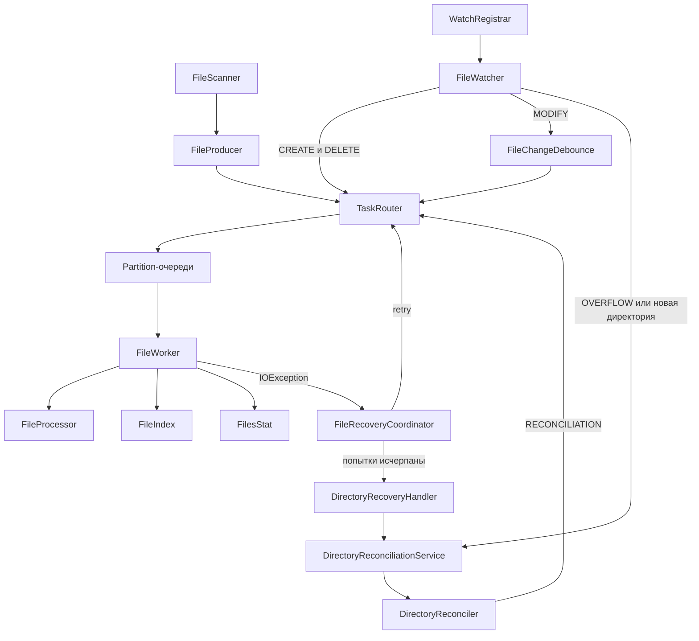

# File Indexer

Учебный многопоточный индексатор Markdown-файлов на Java.

Программа рекурсивно сканирует выбранную директорию, сохраняет метаданные файлов
в памяти, следит за изменениями через `WatchService` и восстанавливает индекс
после временных ошибок или потерянных событий.

Проект развивается поэтапно: каждый механизм добавляется для решения конкретной
проблемы многопоточного приложения. Подробный учебный план находится в
[`PROGRESS.md`](PROGRESS.md).

## Возможности

- рекурсивный поиск `.md`-файлов;
- первоначальное построение индекса;
- автоматическое отслеживание создания, изменения и удаления файлов;
- наблюдение за существующими и новыми вложенными директориями;
- параллельная обработка файлов несколькими Worker-потоками;
- сохранение порядка событий одного пути через partitioning очередей;
- debounce частых событий `MODIFY`;
- подсчёт количества файлов, общего размера и ошибок обработки;
- повторные попытки чтения файла с увеличивающейся задержкой;
- восстановление через повторное сканирование родительской директории;
- обработка `WatchService.OVERFLOW`;
- объединение повторных запросов сканирования одной директории;
- синхронизация запуска watcher и первоначального сканирования;
- автоматические unit-, integration-, concurrency- и stress-тесты.

Сейчас индексируются только файлы с расширением `.md` в нижнем регистре.

## Архитектура



### Основные компоненты

| Компонент | Ответственность |
|---|---|
| `Main` | Создаёт компоненты, связывает зависимости и управляет жизненным циклом |
| `FileScanner` | Рекурсивно находит обычные `.md`-файлы |
| `FileProducer` | Превращает результаты первоначального обхода в `FileTask` |
| `FileWatcher` | Получает события от `WatchService` |
| `WatchRegistrar` | Регистрирует директории и хранит соответствие `WatchKey → Path` |
| `FileChangeDebounce` | Объединяет частые события `MODIFY` одного файла |
| `TaskRouter` | Выбирает очередь по хешу пути |
| `FileWorker` | Обрабатывает задачи и обновляет индекс со статистикой |
| `FileProcessor` | Читает размер и время изменения файла |
| `FileIndex` | Управляет `ConcurrentHashMap<Path, FileInfo>` |
| `FileRecoveryCoordinator` | Управляет ограниченными повторными попытками файла |
| `DirectoryRecoveryHandler` | После исчерпания retry запрашивает проверку родительской папки |
| `DirectoryReconciliationService` | Асинхронно запускает и объединяет повторные проверки директорий |
| `DirectoryReconciler` | Сверяет пути на диске с путями в индексе |

## Модель задачи

Каждая файловая задача содержит:

```text
FileTask
├── Path
├── ChangeType
└── TaskSource
```

`ChangeType` определяет операцию:

- `CREATED`;
- `MODIFIED`;
- `DELETED`.

`TaskSource` показывает происхождение задачи:

- `NORMAL` — первоначальный обход или событие watcher;
- `RECOVERY` — повторная попытка после ошибки;
- `RECONCILIATION` — задача из полной сверки директории.

## Первоначальный запуск

Приложение запускает компоненты в следующем порядке:

```text
Запуск Worker
→ запуск FileWatcher
→ ожидание регистрации существующих директорий
→ первоначальное сканирование
→ обработка файлов
```

Watcher запускается до первоначального обхода, поэтому изменения во время
сканирования не остаются полностью без наблюдения.

Сейчас завершение `FileProducer` ещё не гарантирует, что Worker уже обработали
все первоначальные задачи. Добавление barrier-задач является следующим этапом.

## Обработка событий

### Создание и изменение

`CREATED` и `MODIFIED` обрабатываются как upsert:

- если записи нет, файл добавляется;
- если запись существует, метаданные заменяются;
- общий размер корректируется на разницу между новым и старым значением.

Поэтому повторный `CREATE` и `MODIFY` неизвестного индексу файла не создают
дубликатов.

### Удаление

При `DELETED` запись удаляется из индекса. Повторное удаление безопасно и не
делает статистику отрицательной.

Если файл исчез между событием и чтением метаданных, `NoSuchFileException`
также обрабатывается как удаление.

### Частые изменения

Для `MODIFY` применяется debounce на 500 мс. Новое событие отменяет предыдущую
ожидающую задачу. При удалении файла отложенный `MODIFY` отменяется.

## Порядок и параллельность

`TaskRouter` вычисляет очередь по хешу `Path`. Один путь всегда направляется в
одну очередь и обрабатывается одним Worker:

```text
a.md → Queue-1 → Worker-1
a.md → Queue-1 → Worker-1
b.md → Queue-3 → Worker-3
```

Это сохраняет последовательность событий одного файла. Разные пути могут
обрабатываться параллельно, хотя несколько путей способны попасть в одну
partition-очередь.

## Восстановление после ошибок

При `IOException` запускается одна recovery-цепочка для проблемного пути.
Используются три повторные попытки:

```text
retry 1 → 500 мс
retry 2 → 1000 мс
retry 3 → 2000 мс
```

Успешная обработка удаляет цепочку и отменяет ожидающую попытку. Если все retry
завершились ошибкой, запускается reconciliation родительской директории.

Во время reconciliation объединяются:

- `.md`-файлы, существующие на диске;
- пути этой директории, сохранённые в индексе.

Все объединённые пути повторно проходят через Worker. Благодаря этому индекс
добавляет пропущенные файлы, обновляет существующие и удаляет исчезнувшие.

Если файл остаётся недоступным и после reconciliation, новая бесконечная цепочка
не создаётся: файл считается проблемным до следующего обычного события или
повторной проверки.

Несколько запросов reconciliation одной директории объединяются. Запрос,
пришедший во время текущего обхода, создаёт только один дополнительный проход.

## Технологии

- Java 25;
- Java NIO: `Path`, `Files`, `WatchService`;
- `Thread` и interruption;
- `BlockingQueue` и `ArrayBlockingQueue`;
- `ConcurrentHashMap`;
- `AtomicInteger` и `LongAdder`;
- `ExecutorService`;
- `ScheduledExecutorService` и `ScheduledFuture`;
- Stream API;
- Maven;
- JUnit 5.

## Запуск

Требования:

- JDK 25;
- Maven 3.9+ либо запуск из IntelliJ IDEA.

Сборка и тесты:

```bash
mvn test
```

Запуск из IntelliJ IDEA:

1. Открыть проект как Maven-проект.
2. Выбрать класс `org.example.Main`.
3. Запустить метод `main()`.
4. Ввести абсолютный путь к директории.

После первоначального сканирования программа печатает индекс и статистику.
Затем она продолжает следить за изменениями до нажатия `ENTER`.

## Тестирование

Сейчас набор содержит 37 автоматических тестов. Проверяются:

- повторные `CREATE` и `DELETE`;
- `MODIFY` неизвестного файла;
- исчезновение файла до обработки;
- recovery с увеличением задержки;
- отмена recovery после успеха;
- переход к reconciliation после исчерпания попыток;
- объединение повторных запросов reconciliation;
- восстановление соответствия индекса диску;
- `AccessDeniedException` на уровне recovery-политики;
- обработка `OVERFLOW`;
- сигнал готовности watcher и ошибка его запуска;
- обработка сотен файлов и большого количества повторных событий;
- корректное завершение используемых в тестах потоков.

Последний полный прогон:

```text
Tests run: 37, Failures: 0, Errors: 0, Skipped: 0
BUILD SUCCESS
```

Физическое переполнение системного буфера WatchService и изменение реальных ACL
Windows не создаются в тестах, поскольку такие проверки нестабильны. Вместо
этого детерминированно проверяется реакция приложения на `OVERFLOW` и
`AccessDeniedException`.

## Текущие ограничения

- первоначальный индекс может быть напечатан до обработки всех задач Worker;
- модель остановки Worker пока использует специальный путь `"STOP"` и `null`;
- конкурентная замена задач внутри debounce требует дополнительной проверки;
- вывод ошибок пока основан на `System.err` и `printStackTrace()`;
- поиск по индексу ещё не реализован;
- lifecycle и shutdown под нагрузкой требуют дальнейшего усиления.

## Следующие шаги

1. Добавить служебные задачи `Barrier` и `Stop` без magic string и `null`.
2. Дожидаться обработки всех первоначальных задач перед выводом индекса.
3. Устранить гонки внутри debounce и добавить конкурентные тесты.
4. Усилить lifecycle и shutdown под нагрузкой.
5. Добавить пользовательский поиск по индексу.
