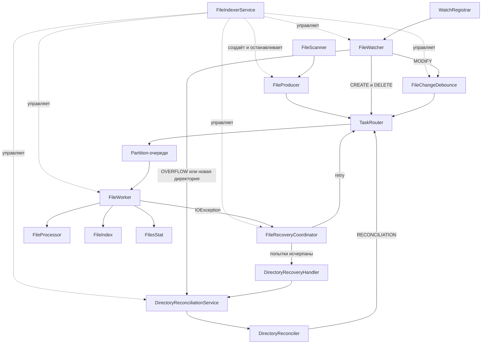

# File Indexer

📖 [Интерактивная карта проекта и памятка](docs/architecture.html) · [Как открыть](docs/README.md)

Учебный многопоточный индексатор Markdown-файлов на Java.

Программа рекурсивно сканирует выбранную директорию, сохраняет метаданные файлов
в памяти, следит за изменениями через `WatchService` и восстанавливает индекс
после временных ошибок или потерянных событий.

Проект развивается поэтапно: каждый механизм добавляется для решения конкретной
проблемы многопоточного приложения. Подробный учебный план находится в
[`PROGRESS.md`](PROGRESS.md).

## Возможности

- рекурсивный поиск `.md`-файлов;
- первоначальное построение индекса;
- автоматическое отслеживание создания, изменения и удаления файлов;
- наблюдение за существующими и новыми вложенными директориями;
- параллельная обработка файлов несколькими Worker-потоками;
- сохранение порядка событий одного пути через partitioning очередей;
- debounce частых событий `MODIFY`;
- подсчёт количества файлов, общего размера и ошибок обработки;
- повторные попытки чтения файла с увеличивающейся задержкой;
- восстановление через повторное сканирование родительской директории;
- обработка `WatchService.OVERFLOW`;
- объединение повторных запросов сканирования одной директории;
- синхронизация запуска watcher и первоначального сканирования;
- отдельный `FileIndexerService` с состояниями lifecycle и согласованным shutdown;
- безопасные конкурентные вызовы `start()` и `shutdown()`;
- сохранение interruption-флага после полной очистки ресурсов;
- автоматические unit-, integration-, concurrency- и stress-тесты.

Сейчас индексируются только файлы с расширением `.md` в нижнем регистре.

## Архитектура



### Основные компоненты

| Компонент | Ответственность |
|---|---|
| `Main` | Читает путь, запускает приложение и пока содержит прежнюю ручную сборку компонентов |
| `FileIndexerService` | Инкапсулирует сборку компонентов, запуск, состояния lifecycle и согласованный shutdown |
| `FileScanner` | Рекурсивно находит обычные `.md`-файлы |
| `FileProducer` | Превращает результаты первоначального обхода в `FileTask` |
| `FileWatcher` | Получает события от `WatchService` |
| `WatchRegistrar` | Регистрирует директории и хранит соответствие `WatchKey → Path` |
| `FileChangeDebounce` | Объединяет частые события `MODIFY` одного файла |
| `TaskRouter` | Выбирает очередь по хешу пути |
| `FileWorker` | Обрабатывает задачи и обновляет индекс со статистикой |
| `FileProcessor` | Читает размер и время изменения файла |
| `FileIndex` | Управляет `ConcurrentHashMap<Path, FileInfo>` |
| `FileRecoveryCoordinator` | Управляет ограниченными повторными попытками файла |
| `DirectoryRecoveryHandler` | После исчерпания retry запрашивает проверку родительской папки |
| `DirectoryReconciliationService` | Асинхронно запускает и объединяет повторные проверки директорий |
| `DirectoryReconciler` | Сверяет пути на диске с путями в индексе |

## Модель задачи

Каждая файловая задача содержит:

```text
FileTask
├── Path
├── ChangeType
└── TaskSource
```

`ChangeType` определяет операцию:

- `CREATED`;
- `MODIFIED`;
- `DELETED`.

`TaskSource` показывает происхождение задачи:

- `NORMAL` — первоначальный обход или событие watcher;
- `RECOVERY` — повторная попытка после ошибки;
- `RECONCILIATION` — задача из полной сверки директории.

## Первоначальный запуск

Приложение запускает компоненты в следующем порядке:

```text
Запуск Worker
→ запуск FileWatcher
→ ожидание регистрации существующих директорий
→ первоначальное сканирование
→ обработка файлов
```

Watcher запускается до первоначального обхода, поэтому изменения во время
сканирования не остаются полностью без наблюдения.

После завершения `FileProducer` в каждую partition-очередь отправляется
`BarrierTask`. `Main` печатает первоначальный индекс только после того, как все
Worker обработали предшествующие barrier файловые задачи.

## Lifecycle и shutdown

`FileIndexerService` использует явные состояния:

```text
NEW → STARTING → RUNNING → STOPPING → STOPPED
```

Проверка состояния и запуск каждого источника задач защищены общим
`lifecycleLock`. Поэтому конкурентный `shutdown()` либо отменяет ещё не
начавшийся шаг запуска, либо корректно останавливает уже запущенный компонент.

Порядок завершения:

```text
Остановить watcher и initial producer
→ запретить новые debounce, recovery и reconciliation-запросы
→ завершить или отменить executor-задачи
→ отправить StopTask каждому Worker
→ дождаться всех Worker
→ установить STOPPED и разбудить ожидающие shutdown-потоки
```

Повторный `shutdown()` во время `STOPPING` ждёт полного завершения первого.
Прерывание не обрывает очистку: оно запоминается, а interruption-флаг
восстанавливается после освобождения ресурсов.

Сервис уже проверяется напрямую lifecycle-тестами. Перевод `Main` с прежней
ручной сборки на `FileIndexerService` остаётся ближайшим интеграционным шагом.

## Обработка событий

### Создание и изменение

`CREATED` и `MODIFIED` обрабатываются как upsert:

- если записи нет, файл добавляется;
- если запись существует, метаданные заменяются;
- общий размер корректируется на разницу между новым и старым значением.

Поэтому повторный `CREATE` и `MODIFY` неизвестного индексу файла не создают
дубликатов.

### Удаление

При `DELETED` запись удаляется из индекса. Повторное удаление безопасно и не
делает статистику отрицательной.

Если файл исчез между событием и чтением метаданных, `NoSuchFileException`
также обрабатывается как удаление.

### Частые изменения

Для `MODIFY` применяется debounce на 500 мс. Новое событие отменяет предыдущую
ожидающую задачу. При удалении файла отложенный `MODIFY` отменяется.

Замена ожидающей задачи выполняется атомарно для конкретного пути. Каждая
запланированная задача получает собственный номер, поэтому завершившийся старый
callback не может удалить из `Map` более новую задачу.

## Порядок и параллельность

`TaskRouter` вычисляет очередь по хешу `Path`. Один путь всегда направляется в
одну очередь и обрабатывается одним Worker:

```text
a.md → Queue-1 → Worker-1
a.md → Queue-1 → Worker-1
b.md → Queue-3 → Worker-3
```

Это сохраняет последовательность событий одного файла. Разные пути могут
обрабатываться параллельно, хотя несколько путей способны попасть в одну
partition-очередь.

## Восстановление после ошибок

При `IOException` запускается одна recovery-цепочка для проблемного пути.
Используются три повторные попытки:

```text
retry 1 → 500 мс
retry 2 → 1000 мс
retry 3 → 2000 мс
```

Успешная обработка удаляет цепочку и отменяет ожидающую попытку. Если все retry
завершились ошибкой, запускается reconciliation родительской директории.

Во время reconciliation объединяются:

- `.md`-файлы, существующие на диске;
- пути этой директории, сохранённые в индексе.

Все объединённые пути повторно проходят через Worker. Благодаря этому индекс
добавляет пропущенные файлы, обновляет существующие и удаляет исчезнувшие.

Если файл остаётся недоступным и после reconciliation, новая бесконечная цепочка
не создаётся: файл считается проблемным до следующего обычного события или
повторной проверки.

Несколько запросов reconciliation одной директории объединяются. Запрос,
пришедший во время текущего обхода, создаёт только один дополнительный проход.

## Технологии

- Java 25;
- Java NIO: `Path`, `Files`, `WatchService`;
- `Thread` и interruption;
- `BlockingQueue` и `ArrayBlockingQueue`;
- `ConcurrentHashMap`;
- `AtomicInteger` и `LongAdder`;
- `ExecutorService`;
- `ScheduledExecutorService` и `ScheduledFuture`;
- Stream API;
- Maven;
- JUnit 5.

## Запуск

Требования:

- JDK 25;
- Maven 3.9+ либо запуск из IntelliJ IDEA.

Сборка и тесты:

```bash
mvn test
```

Запуск из IntelliJ IDEA:

1. Открыть проект как Maven-проект.
2. Выбрать класс `org.example.Main`.
3. Запустить метод `main()`.
4. Ввести абсолютный путь к директории.

После первоначального сканирования программа печатает индекс и статистику.
Затем она продолжает следить за изменениями до нажатия `ENTER`.

## Тестирование

Тестовый набор содержит 58 обычных сценариев и 25 повторных lifecycle-запусков:
83 JUnit-выполнения в 14 классах. Это сценарное покрытие, а не процент покрытия
строк кода.

| Подсистема | Что проверяется | Тестов | Статус |
|---|---|---:|:---:|
| Модель задач | Fail-fast для `FileTask` и `BarrierTask`, значения по умолчанию | 5 | ✅ |
| Индекс и Worker | Snapshot, повторные `CREATE` и `DELETE`, неизвестный и исчезнувший файл, barrier | 9 | ✅ |
| Watcher | Создание `.md`, игнорирование других файлов, вложенные директории, запуск, `OVERFLOW` | 6 | ✅ |
| Debounce | 2000 быстрых и конкурентные `MODIFY`, порядок событий, отмена и shutdown | 9 | ✅ |
| Recovery | Retry, задержки, независимые цепочки, успех, исчерпание попыток, проблемный файл | 17 | ✅ |
| Reconciliation | Сверка диска и индекса, объединение запросов, повторный запуск, ошибки и interruption | 9 | ✅ |
| Интеграция и нагрузка | Сходимость индекса, 200 файлов и 800 событий, изменения во время initial scan | 3 | ✅ |
| Lifecycle сервиса | Конкурентные start/shutdown, два shutdown, interruption и отсутствие живых потоков | 25 | ✅ |
| **Всего** | **Unit-, integration-, concurrency- и stress-сценарии** | **83** | **✅** |

### Карта тестовых классов

```text
83 выполнения тестов
├── задачи: FileTaskTest, BarrierTaskTest
├── индекс: FileIndexTest, FileWorkerTest
├── watcher: FileWatcherTest, FileWatcherOverflowTest
├── debounce: FileChangeDebounceTest
├── recovery: FileRecoveryCoordinatorTest, DirectoryRecoveryHandlerTest
├── reconciliation: DirectoryReconcilerTest,
│                   DirectoryReconciliationServiceTest
├── lifecycle: FileIndexerServiceLifecycleTest
└── интеграция: IndexResilienceIntegrationTest,
                InitialScanConcurrencyTest
```

Отдельно проверено, что старая уже выполняющаяся debounce-задача не удаляет
ссылку на более новую ожидающую задачу. Этот тест воспроизводит реальную гонку,
а не только последовательный вызов методов.

Последний полный прогон:

```text
Tests run: 83, Failures: 0, Errors: 0, Skipped: 0
BUILD SUCCESS
```

Физическое переполнение системного буфера WatchService и изменение реальных ACL
Windows не создаются в тестах, поскольку такие проверки нестабильны. Вместо
этого детерминированно проверяется реакция приложения на `OVERFLOW` и
`AccessDeniedException`.

## Текущие ограничения

- вывод ошибок пока основан на `System.err` и `printStackTrace()`;
- поиск по индексу ещё не реализован;
- `Main` ещё не переведён с прежней ручной сборки на `FileIndexerService`;
- shutdown при полностью заполненных Worker-очередях ещё не проверен;
- переходы повторного `start()` и остановки до первого запуска требуют
  отдельных тестов;
- физический `OVERFLOW` и изменение реальных Windows ACL заменены
  детерминированными тестовыми сценариями.

## Следующие шаги

1. Перевести `Main` на `FileIndexerService`.
2. Завершить тесты переходов lifecycle и shutdown заполненных очередей.
3. Реализовать `AutoCloseable` для сервиса.
4. Инкапсулировать внутреннее состояние индекса и статистики.
5. Добавить пользовательский поиск по индексу.
6. Завершить логирование, конфигурацию и подготовку к публикации.
