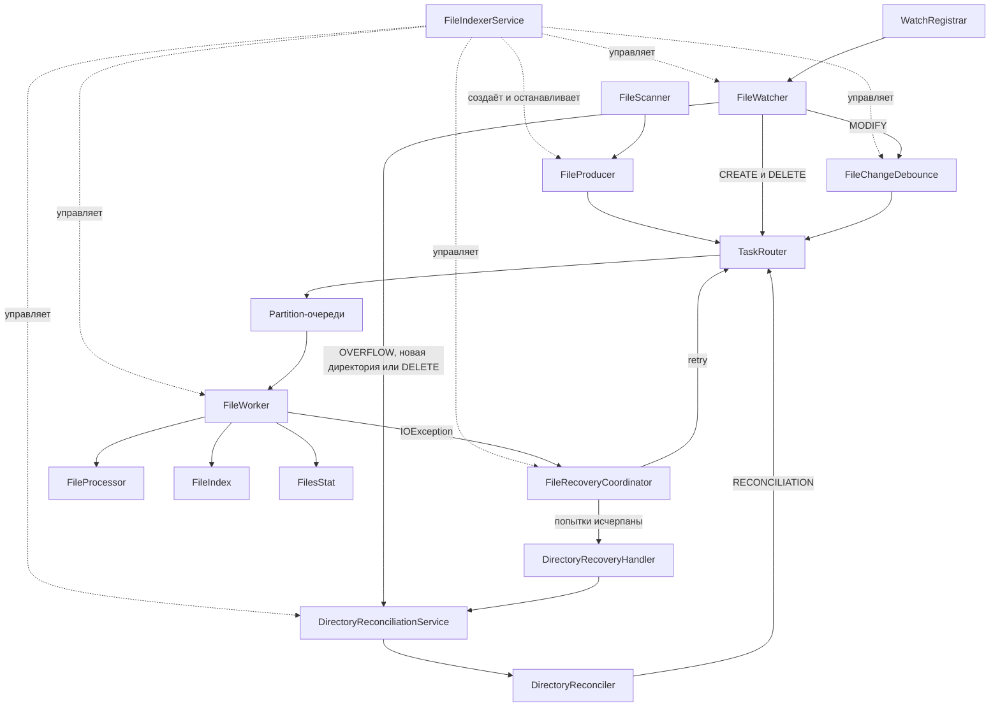

# File Indexer

📖 [Интерактивная карта проекта и памятка](docs/architecture.html) · [Как открыть](docs/README.md)

Учебный многопоточный индексатор Markdown-файлов на Java.

Программа рекурсивно сканирует выбранную директорию, сохраняет метаданные файлов
в памяти, следит за изменениями через `WatchService` и восстанавливает индекс
после временных ошибок или потерянных событий.

Проект развивается поэтапно: каждый механизм добавляется для решения конкретной
проблемы многопоточного приложения. Подробный учебный план находится в
[`PROGRESS.md`](PROGRESS.md).

Новое направление — учебная локальная система версий на базе индексатора.
Сначала планируются ручные коммиты, сохранение содержимого, status, построчный
diff и история. Затем — восстановление версий и автоматическое сохранение.
Эти возможности пока не реализованы. Первая версия сохраняет `.md`-файлы,
использует собственный формат и линейную историю без веток и удалённого обмена.

## Возможности

- рекурсивный поиск `.md`-файлов;
- первоначальное построение индекса;
- автоматическое отслеживание создания, изменения и удаления файлов;
- наблюдение за существующими и новыми вложенными директориями;
- параллельная обработка файлов несколькими Worker-потоками;
- сохранение порядка событий одного пути через partitioning очередей;
- debounce частых событий `MODIFY`;
- подсчёт количества файлов, общего размера и ошибок обработки;
- повторные попытки чтения файла с увеличивающейся задержкой;
- восстановление через повторное сканирование родительской директории;
- обработка `WatchService.OVERFLOW`;
- объединение повторных запросов сканирования одной директории;
- синхронизация запуска watcher и первоначального сканирования;
- отдельный `FileIndexerService` с состояниями lifecycle и согласованным shutdown;
- безопасные конкурентные вызовы `start()` и `shutdown()`;
- сохранение interruption-флага после полной очистки ресурсов;
- передача ошибок initial scan из producer в сервис с остановкой ресурсов;
- абсолютные нормализованные пути для initial scan и watcher;
- согласованный immutable snapshot индекса и статистики под общей блокировкой;
- автоматические unit-, integration-, concurrency- и stress-тесты.

Сейчас индексируются только файлы с расширением `.md` в нижнем регистре.

## Архитектура


```mermaid
flowchart TD
    Lifecycle[FileIndexerService] -. создаёт и останавливает .-> Producer
    Lifecycle -. управляет .-> Watcher
    Lifecycle -. управляет .-> Workers
    Lifecycle -. управляет .-> Debounce
    Lifecycle -. управляет .-> Service
    Lifecycle -. управляет .-> Recovery

    Scanner[FileScanner] --> Producer[FileProducer]
    Producer --> Router[TaskRouter]

    Registrar[WatchRegistrar] --> Watcher[FileWatcher]
    Watcher -->|CREATE и DELETE| Router
    Watcher -->|MODIFY| Debounce[FileChangeDebounce]
    Debounce --> Router

    Watcher -->|OVERFLOW, новая директория или DELETE| Service[DirectoryReconciliationService]
    Service --> Reconciler[DirectoryReconciler]
    Reconciler -->|RECONCILIATION| Router

    Router --> Queues[Partition-очереди]
    Queues --> Workers[FileWorker]
    Workers --> Processor[FileProcessor]
    Workers --> Index[FileIndex]
    Workers --> Statistics[FilesStat]

    Workers -->|IOException| Recovery[FileRecoveryCoordinator]
    Recovery -->|retry| Router
    Recovery -->|попытки исчерпаны| Handler[DirectoryRecoveryHandler]
    Handler --> Service
```

### Основные компоненты

| Компонент | Ответственность |
|---|---|
| `Main` | Читает путь, запускает `FileIndexerService` и выводит snapshot индекса со статистикой |
| `FileIndexerService` | Инкапсулирует сборку компонентов, запуск, состояния lifecycle и согласованный shutdown |
| `FileScanner` | Рекурсивно находит обычные `.md`-файлы |
| `FileProducer` | Превращает результаты первоначального обхода в `FileTask` |
| `FileWatcher` | Получает события от `WatchService` |
| `WatchRegistrar` | Регистрирует директории и хранит соответствие `WatchKey → Path` |
| `FileChangeDebounce` | Объединяет частые события `MODIFY` одного файла |
| `TaskRouter` | Выбирает очередь по хешу пути |
| `FileWorker` | Обрабатывает задачи и обновляет индекс со статистикой |
| `FileProcessor` | Читает размер и время изменения файла |
| `FileIndex` | Управляет `ConcurrentHashMap<Path, FileInfo>` |
| `FilesStat` | Хранит внутренние счётчики и обновляет их через смысловые операции |
| `FileRecoveryCoordinator` | Управляет ограниченными повторными попытками файла |
| `DirectoryRecoveryHandler` | После исчерпания retry запрашивает проверку родительской папки |
| `DirectoryReconciliationService` | Асинхронно запускает и объединяет повторные проверки директорий |
| `DirectoryReconciler` | Сверяет пути на диске с путями в индексе |

## Модель задачи

Каждая файловая задача содержит:

```text
FileTask
├── Path
├── ChangeType
└── TaskSource
```

`ChangeType` определяет операцию:

- `CREATED`;
- `MODIFIED`;
- `DELETED`.

`TaskSource` показывает происхождение задачи:

- `NORMAL` — первоначальный обход или событие watcher;
- `RECOVERY` — повторная попытка после ошибки;
- `RECONCILIATION` — задача из полной сверки директории.

## Первоначальный запуск

Приложение запускает компоненты в следующем порядке:

```text
Запуск Worker
→ запуск FileWatcher
→ ожидание регистрации существующих директорий
→ первоначальное сканирование
→ обработка файлов
```

Watcher запускается до первоначального обхода, поэтому изменения во время
сканирования не остаются полностью без наблюдения.

После завершения `FileProducer` в каждую partition-очередь отправляется
`BarrierTask`. `Main` печатает первоначальный индекс только после того, как все
Worker обработали предшествующие barrier файловые задачи.

`FileProducer` сохраняет `IOException` или причину `UncheckedIOException`.
После `join()` сервис проверяет ошибку: неудачный initial scan приводит к
`shutdown()` и исключению из `start()`, а не к успешному запуску.

Корень преобразуется в абсолютный нормализованный путь в конструкторе сервиса
и передаётся в таком виде watcher и producer.

### Согласованность snapshot

Все Worker одного сервиса используют общий `indexStateLock`. Добавление,
обновление или удаление записи и соответствующее изменение статистики
выполняются под этой блокировкой. `snapshot()` копирует Map и читает счётчики
под той же блокировкой. Чтение файлов и вызовы recovery остаются вне неё.
Снимок согласован с индексом, но не является атомарным снимком самого диска.

## Lifecycle и shutdown

`FileIndexerService` использует явные состояния:

```text
NEW → STARTING → RUNNING → STOPPING → STOPPED
```

Проверка состояния и запуск каждого источника задач защищены общим
`lifecycleLock`. Поэтому конкурентный `shutdown()` либо отменяет ещё не
начавшийся шаг запуска, либо корректно останавливает уже запущенный компонент.

Порядок завершения:

```text
Остановить watcher и initial producer
→ запретить новые debounce, recovery и reconciliation-запросы
→ завершить или отменить executor-задачи
→ отправить StopTask каждому Worker
→ дождаться всех Worker
→ установить STOPPED и разбудить ожидающие shutdown-потоки
```

Повторный `shutdown()` во время `STOPPING` ждёт полного завершения первого.
Прерывание не обрывает очистку: оно запоминается, а interruption-флаг
восстанавливается после освобождения ресурсов.

Сервис реализует `AutoCloseable`, поэтому `Main` использует его через
try-with-resources. Lifecycle-тесты проверяют крайние переходы состояний,
конкурентную остановку и shutdown при заполненной Worker-очереди.

## Обработка событий

### Создание и изменение

`CREATED` и `MODIFIED` обрабатываются как upsert:

- если записи нет, файл добавляется;
- если запись существует, метаданные заменяются;
- общий размер корректируется на разницу между новым и старым значением.

Поэтому повторный `CREATE` и `MODIFY` неизвестного индексу файла не создают
дубликатов.

### Удаление

При `DELETED` запись удаляется из индекса. Повторное удаление безопасно и не
делает статистику отрицательной.

Если файл исчез между событием и чтением метаданных, `NoSuchFileException`
также обрабатывается как удаление.

### Частые изменения

Для `MODIFY` применяется debounce на 500 мс. Новое событие отменяет предыдущую
ожидающую задачу. При удалении файла отложенный `MODIFY` отменяется.

Замена ожидающей задачи выполняется атомарно для конкретного пути. Каждая
запланированная задача получает собственный номер, поэтому завершившийся старый
callback не может удалить из `Map` более новую задачу.

## Порядок и параллельность

`TaskRouter` вычисляет очередь по хешу `Path`. Один путь всегда направляется в
одну очередь и обрабатывается одним Worker:

```text
a.md → Queue-1 → Worker-1
a.md → Queue-1 → Worker-1
b.md → Queue-3 → Worker-3
```

Это сохраняет последовательность событий одного файла. Разные пути могут
обрабатываться параллельно, хотя несколько путей способны попасть в одну
partition-очередь.

## Восстановление после ошибок

При `IOException` запускается одна recovery-цепочка для проблемного пути.
Используются три повторные попытки:

```text
retry 1 → 500 мс
retry 2 → 1000 мс
retry 3 → 2000 мс
```

Успешная обработка удаляет цепочку и отменяет ожидающую попытку. Если все retry
завершились ошибкой, запускается reconciliation родительской директории.

Во время reconciliation объединяются:

- `.md`-файлы, существующие на диске;
- пути этой директории, сохранённые в индексе.

Все объединённые пути повторно проходят через Worker. Благодаря этому индекс
добавляет пропущенные файлы, обновляет существующие и удаляет исчезнувшие.

Если файл остаётся недоступным и после reconciliation, новая бесконечная цепочка
не создаётся: файл считается проблемным до следующего обычного события или
повторной проверки.

Несколько запросов reconciliation одной директории объединяются. Запрос,
пришедший во время текущего обхода, создаёт только один дополнительный проход.

## Технологии

- Java 25;
- Java NIO: `Path`, `Files`, `WatchService`;
- `Thread` и interruption;
- `BlockingQueue` и `ArrayBlockingQueue`;
- `ConcurrentHashMap`;
- `AtomicInteger` и `LongAdder`;
- `ExecutorService`;
- `ScheduledExecutorService` и `ScheduledFuture`;
- Stream API;
- Maven;
- JUnit 5.

## Запуск

Требования:

- JDK 25;
- Maven 3.9+ либо запуск из IntelliJ IDEA.

Сборка и тесты:

```bash
mvn test
```

Запуск из IntelliJ IDEA:

1. Открыть проект как Maven-проект.
2. Выбрать класс `org.example.Main`.
3. Запустить метод `main()`.
4. Ввести абсолютный путь к директории.

После первоначального сканирования программа печатает индекс и статистику.
Затем она продолжает следить за изменениями до нажатия `ENTER`.

## Тестирование

Тестовый набор содержит 87 обычных сценариев и 25 повторных lifecycle-запусков:
112 JUnit-выполнений в 19 классах. Это сценарное покрытие, а не процент покрытия
строк кода.

| Подсистема | Что проверяется | Тестов | Статус |
|---|---|---:|:---:|
| Модель задач | Fail-fast для `FileTask` и `BarrierTask`, значения по умолчанию | 5 | ✅ |
| Индекс и Worker | Независимый immutable snapshot, повторные `CREATE` и `DELETE`, неизвестный и исчезнувший файл, barrier | 12 | ✅ |
| Статистика | Добавление, удаление, изменение размера, ошибки и конкурентные обновления | 5 | ✅ |
| Watcher | Создание `.md`, вложенные директории, перенос дерева наружу, удаление дерева, фильтрация `MODIFY` папки `.md`, запуск, `OVERFLOW` | 10 | ✅ |
| Debounce | 2000 быстрых и конкурентные `MODIFY`, порядок событий, отмена и shutdown | 9 | ✅ |
| Recovery | Retry, задержки, независимые цепочки, успех, исчерпание попыток, проблемный файл | 17 | ✅ |
| Reconciliation | Сверка диска и индекса, объединение запросов, повторный запуск после `IOException` и `UncheckedIOException`, interruption | 10 | ✅ |
| Интеграция и нагрузка | Сходимость индекса, 200 файлов и 800 событий, изменения во время initial scan | 3 | ✅ |
| Lifecycle и пути сервиса | Крайние переходы, start/shutdown, ошибки initial scan, заполненная очередь, относительный корень, согласованность snapshot | 38 | ✅ |
| Producer | Успешный обход, сохранение `IOException` и причины `UncheckedIOException` | 3 | ✅ |
| **Всего** | **Unit-, integration-, concurrency- и stress-сценарии** | **112** | **✅** |

### Карта тестовых классов

```text
112 выполнений тестов
├── задачи: FileTaskTest, BarrierTaskTest
├── индекс: FileIndexTest, FileWorkerTest
├── статистика: FilesStatTest
├── watcher: FileWatcherTest, FileWatcherOverflowTest, FileWatcherModifyTest
├── producer: FileProducerTest
├── debounce: FileChangeDebounceTest
├── recovery: FileRecoveryCoordinatorTest, DirectoryRecoveryHandlerTest
├── reconciliation: DirectoryReconcilerTest,
│                   DirectoryReconciliationServiceTest
├── lifecycle: FileIndexerServiceLifecycleTest,
│             FileIndexerServiceSnapshotTest, FileIndexerServicePathTest
└── интеграция: IndexResilienceIntegrationTest,
                InitialScanConcurrencyTest
```

Отдельно проверено, что старая уже выполняющаяся debounce-задача не удаляет
ссылку на более новую ожидающую задачу. Этот тест воспроизводит реальную гонку,
а не только последовательный вызов методов.

Последний подтверждённый полный прогон (2026-10-05):

```text
Tests run: 112, Failures: 0, Errors: 0, Skipped: 0
BUILD SUCCESS
```

Ранее найденное расхождение после переноса заполненной директории наружу
исправлено через reconciliation родителя при `DELETE`; добавлены regression-тесты
переноса и удаления дерева. Статусы исправлений и оставшиеся ограничения описаны в
[`INDEXER_REVIEW.md`](docs/INDEXER_REVIEW.md).

Физическое переполнение системного буфера WatchService и изменение реальных ACL
Windows не создаются в тестах, поскольку такие проверки нестабильны. Вместо
этого детерминированно проверяется реакция приложения на `OVERFLOW` и
`AccessDeniedException`.

## Текущие ограничения

- вывод ошибок пока основан на `System.err` и `printStackTrace()`;
- ошибка ленивого обхода `UncheckedIOException` в регистрации директорий ещё
  не передаётся сервису как ошибка запуска watcher;
- проверка папки в watcher не защищает от смены типа пути между событием и
  обработкой: `FileProcessor` пока не проверяет тип прочитанного объекта;
- удаление самого корня и произвольные runtime-ошибки reconciliation требуют
  отдельной политики; shutdown не имеет общего предельного времени ожидания Worker;
- поиск по индексу ещё не реализован;
- физический `OVERFLOW` и изменение реальных Windows ACL заменены
  детерминированными тестовыми сценариями.

## Следующие шаги

Инкапсуляция завершена: `FileIndex` самостоятельно создаёт Map и возвращает
неизменяемые копии, а `FilesStat` скрывает атомики и принимает операции
`fileAdded`, `fileSizeChanged`, `fileRemoved` и `recordError`.

Новый план согласован в `PROGRESS.md`: устройство репозитория → хранение
содержимого → ручные коммиты → status → построчный diff → команды и история →
восстановление → автоматическая история. Ближайшая задача — завершить открытые
пункты аудита, зафиксировать основу, затем перейти к этапу 14.

Watcher будет помогать обнаруживать изменения, а сохранение коммита должно
проверять фактическое содержимое диска. Пользовательский поиск исключён из
ближайшего плана. Открытые задачи надёжности и технического долга сохранены.
